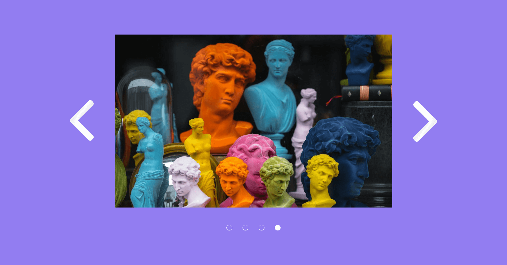

<div align="center">
 <a href="/design" target="_blank">
      
    </a>
  <h3 align="center">Practice JavaScript</h3>
</div>

##  <br /> 📋 <a name="table">Table of Contents</a>

- ✨ [Introduction](#introduction)
- ⚙️ [Tech Stack](#tech-stack)
- 🚀 [Quick Start](#quick-start)

##  <br /> <a name="introduction">✨ Introduction</a>

**[EN]** This repository contains a collection of practice exercises built using only JavaScript, aimed at enhancing coding skills and understanding of core JavaScript concepts. The exercises include various components such as:

[Preview](/design)
- Filter: Implementing dynamic filtering of data based on user input.
- Quiz: Creating an interactive quiz application with multiple-choice questions and scoring.
- Slider: Building a simple image slider/carousel with navigation controls.

Each exercise focuses on different aspects of JavaScript programming, providing hands-on experience with DOM manipulation, event handling, and API interactions. This repository is a valuable resource for developers looking to practice and improve their JavaScript skills through practical examples.

**[FR]** Ce dépôt contient une compilation d'exercices pratiques construits uniquement en JavaScript, visant à améliorer les compétences en codage et la compréhension des concepts fondamentaux de JavaScript. Les exercices incluent divers composants tels que :

[Preview](/design)
- Filtre : Implémentation du filtrage dynamique de données basé sur l'entrée utilisateur.
- Quiz : Création d'une application de quiz interactive avec des questions à choix multiples et un système de score.
- Slider : Construction d'un simple slider/carrousel d'images avec des contrôles de navigation.

Chaque exercice se concentre sur différents aspects de la programmation JavaScript, offrant une expérience pratique avec la manipulation du DOM, la gestion des événements et les interactions avec les API. Ce dépôt est une ressource précieuse pour les développeurs souhaitant pratiquer et améliorer leurs compétences en JavaScript à travers des exemples pratiques.

##  <br /> <a name="tech-stack">⚙️ Tech Stack</a>

- **HTML** (HyperText Markup Language) is the standard markup language used for creating web pages. It provides the structure of a webpage by defining elements such as headings, paragraphs, links, images, and other content. HTML elements are represented by tags, which tell the browser how to display the content.

- **CSS** (Cascading Style Sheets) is a style sheet language used to describe the presentation of a document written in HTML. CSS controls the layout, colors, fonts, and overall visual appearance of web pages. By separating content from design, CSS enables developers to maintain and update the visual style of multiple pages efficiently.
  
- **JavaScript** is a versatile, high-level programming language commonly used for web development. It enables interactive elements on web pages, such as dynamic content updates, form validation, animations, and user interface enhancements. JavaScript runs in the browser and is integral to building modern, interactive websites and web applications.

## <br /> <a name="quick-start">🚀 Quick Start</a>

Follow these steps to set up the project locally on your machine.

<br/>**Prerequisites**

Make sure you have the following installed on your machine:

- [Git](https://git-scm.com/)
- [Node.js](https://nodejs.org/en)
- [npm](https://www.npmjs.com/) (Node Package Manager)

<br/>**Cloning the Repository**

```bash
git clone {git remote URL}
```

<br/>**Running the Project**

Use [Live Server](https://marketplace.visualstudio.com/items?itemName=ritwickdey.LiveServer)
to launch a development local server with live reload feature for static & dynamic pages.